# Project Specifications Document

## Executive Summary

This repository contains comprehensive documentation and implementation details for a production-grade Network Attached Storage (NAS) server deployed as part of an internship project at LNJ Solution.

**Project Duration:** December 1, 2024 - March 1, 2025

### Key Objectives
1. Build scalable, secure, and globally accessible NAS infrastructure
2. Achieve 99.9% data availability through redundancy
3. Implement enterprise-grade security measures
4. Optimize performance for concurrent multi-user access

---

## Project Context

### Academic Information
- **Student:** Divyansh Joshi (22BCE11364)
- **Institution:** VIT Bhopal University
- **Program:** B.Tech CSE-Core, SCOPE
- **Faculty Supervisor:** Dr. E. Nirmala (Program Chair, CSE-Core)

### Industry Information
- **Organization:** LNJ Corp Solution (Limited Liability Partnership)
- **Industry Supervisor:** Mr. Bhushan Tambe
- **Project Type:** Internship Project
- **Duration:** 3 months (90 days)

---

## Technical Specifications

### Hardware Architecture

### Software Stack

| Layer | Technology | Purpose |
|-------|-----------|---------|
| **Hypervisor** | Proxmox VE 8.x | Virtualization platform |
| **Operating System** | Debian 12 (Bookworm) | Primary VM OS |
| **Storage Management** | TrueNAS SCALE | NAS functionality |
| **Container Platform** | CasaOS | Application management |
| **File System** | ZFS | Storage with RAID-Z2 |
| **VPN** | ZeroTier/Tailscale | Secure remote access |
| **Media Server** | Plex | Media streaming |
| **Monitoring** | Prometheus + Grafana | System monitoring |

---

## Functional Requirements

### FR-1: Data Storage & Management
- **FR-1.1:** Support for 12TB primary storage with RAID-Z2 redundancy
- **FR-1.2:** Automated hourly snapshots with 24-hour retention
- **FR-1.3:** Daily backups to separate 5TB backup pool
- **FR-1.4:** File-level and block-level deduplication
- **FR-1.5:** Compression using LZ4 algorithm

### FR-2: Remote Access
- **FR-2.1:** Secure VPN-based remote access for 15+ users
- **FR-2.2:** SSH key-based authentication only
- **FR-2.3:** Web-based management interface
- **FR-2.4:** Mobile app support for iOS/Android

### FR-3: Security
- **FR-3.1:** AES-256-GCM encryption at rest
- **FR-3.2:** TLS 1.3 encryption in transit
- **FR-3.3:** Multi-factor authentication support
- **FR-3.4:** Automated security updates
- **FR-3.5:** Comprehensive audit logging

### FR-4: Performance
- **FR-4.1:** Sequential read speeds: 540+ MB/s
- **FR-4.2:** Sequential write speeds: 456+ MB/s
- **FR-4.3:** Support for 15+ concurrent users
- **FR-4.4:** 99.9% uptime guarantee

### FR-5: Monitoring & Alerting
- **FR-5.1:** Real-time system metrics dashboard
- **FR-5.2:** Email alerts for critical events
- **FR-5.3:** SMART disk health monitoring
- **FR-5.4:** Network traffic analysis

---

## Non-Functional Requirements

### NFR-1: Reliability
- **NFR-1.1:** Maximum annual downtime: 8.76 hours (99.9% uptime)
- **NFR-1.2:** Mean Time Between Failures (MTBF): 720 hours
- **NFR-1.3:** Mean Time To Recovery (MTTR): < 15 minutes
- **NFR-1.4:** Automated failover for critical services

### NFR-2: Scalability
- **NFR-2.1:** Support for adding up to 8 additional drives
- **NFR-2.2:** Horizontal scaling through additional VMs
- **NFR-2.3:** Network bandwidth upgradable to 10Gbps
- **NFR-2.4:** Memory expandable to 128GB

### NFR-3: Security
- **NFR-3.1:** Zero-trust network architecture
- **NFR-3.2:** Compliance with ISO 27001 guidelines
- **NFR-3.3:** Regular security audits (quarterly)
- **NFR-3.4:** Vulnerability patching within 48 hours

### NFR-4: Usability
- **NFR-4.1:** Intuitive web-based management interface
- **NFR-4.2:** Comprehensive documentation
- **NFR-4.3:** Self-service user portal
- **NFR-4.4:** 24/7 monitoring dashboard access

### NFR-5: Maintainability
- **NFR-5.1:** Automated backup verification
- **NFR-5.2:** Centralized logging with 90-day retention
- **NFR-5.3:** Version-controlled configuration files
- **NFR-5.4:** Disaster recovery procedures documented

---

## System Architecture

### Deployment Architecture

### Component Architecture

---

## Data Flow Diagrams

### File Upload Process

### Backup & Recovery Process

---

## Quality Assurance

### Testing Strategy

| Test Type | Frequency | Tools | Coverage |
|-----------|-----------|-------|----------|
| **Unit Testing** | Per commit | Custom scripts | 80%+ |
| **Integration Testing** | Daily | Automated pipeline | 75%+ |
| **Performance Testing** | Weekly | iperf3, fio | Key metrics |
| **Security Testing** | Monthly | Nmap, Lynis | Full system |
| **Disaster Recovery** | Quarterly | Manual procedures | Critical services |

### Quality Metrics

- **Code Quality:** Maintained through GitHub code reviews
- **Documentation:** IEEE format compliance
- **Performance:** Benchmarked against baseline
- **Security:** Vulnerability score < 5 critical issues
- **Reliability:** 99.9% uptime SLA

---

## Risk Management

### Risk Matrix

```mermaid
graph TD
    subgraph "Risk Assessment"
        A[Hardware Failure<br/>Medium/High] --> A1[✓ RAID redundancy]
        B[Data Loss<br/>Low/Critical] --> B1[✓ Multi-layer backup]
        C[Security Breach<br/>Low/High] --> C1[✓ Multi-layer security]
        D[Performance Degradation<br/>Medium/Medium] --> D1[✓ Monitoring & tuning]
        E[Network Outage<br/>Medium/Medium] --> E1[✓ Dual NICs]
    end
    
    style A fill:#ffa726
    style B fill:#ef5350
    style C fill:#ffa726
    style D fill:#ffee58
    style E fill:#ffee58
```

---

## Budget & Resources

### Budget Allocation
*All costs approved by Mr. Bhushan Tambe and borne by LNJ Corp Solution LLP*

| Category | Percentage | Status |
|----------|-----------|--------|
| Hardware | 60% | ✅ Complete |
| Software Licenses | 15% | ✅ Complete |
| Network Equipment | 15% | ✅ Complete |
| Training & Documentation | 10% | 🔄 In Progress |

### Resource Allocation
- **Development:** 40 hours/week
- **Testing:** 10 hours/week
- **Documentation:** 8 hours/week
- **Meetings & Reviews:** 2 hours/week

---

## Compliance & Standards

### Technical Standards
- ✅ IEEE 802.3 (Ethernet)
- ✅ RFC 2616 (HTTP/1.1)
- ✅ RFC 4251 (SSH Protocol)
- ✅ IEEE 802.11 (Wireless LAN)

### Security Standards
- ✅ NIST Cybersecurity Framework
- ✅ CIS Controls
- 🔄 ISO 27001 (Information Security)
- 🔄 GDPR Compliance (Data Protection)

### Documentation Standards
- ✅ IEEE format for technical reports
- ✅ Markdown for repository documentation
- ✅ UML for system diagrams
- ✅ Mermaid for workflow diagrams

---

## Success Criteria

### Technical Success
- [x] System achieves 99.9% uptime
- [x] Performance meets or exceeds specifications
- [ ] Security audit completed with no critical issues
- [ ] All functional requirements implemented

### Academic Success
- [ ] Final report submitted in IEEE format
- [ ] Monthly technical reports completed
- [ ] Faculty approval obtained
- [ ] Academic credit awarded

### Business Success
- [x] Budget within approved limits
- [ ] Client satisfaction achieved
- [ ] Handover documentation complete
- [ ] Support procedures established

---

## Future Enhancements

### Phase 2 Roadmap (Post-Internship)
1. **Kubernetes Integration:** Migrate services to K8s
2. **AI/ML Workloads:** Support for data science applications
3. **Geo-Redundancy:** Multi-site replication
4. **Advanced Analytics:** Predictive maintenance using ML
5. **API Development:** RESTful API for third-party integration

---

## References & Resources

### Documentation
- Proxmox VE Administration Guide
- ZFS on Linux Documentation
- Debian Administrator's Handbook
- TrueNAS SCALE User Guide

### Standards & Guidelines
- NIST SP 800-53 (Security Controls)
- CIS Benchmarks (Security Configuration)
- IEEE 830-1998 (Software Requirements)

---

## Approval & Sign-off

**Document Version:** 1.0  
**Last Updated:** February 4, 2025

**Prepared By:**  
Divyansh Joshi (22BCE11364)  
Student, VIT Bhopal University

**Reviewed By:**  
Dr. E. Nirmala  
Program Chair, CSE-Core, SCOPE  
VIT Bhopal University

**Approved By:**  
Mr. Bhushan Tambe  
LNJ Corp Solution LLP

---

*This document is maintained under version control and updated as the project progresses.*
