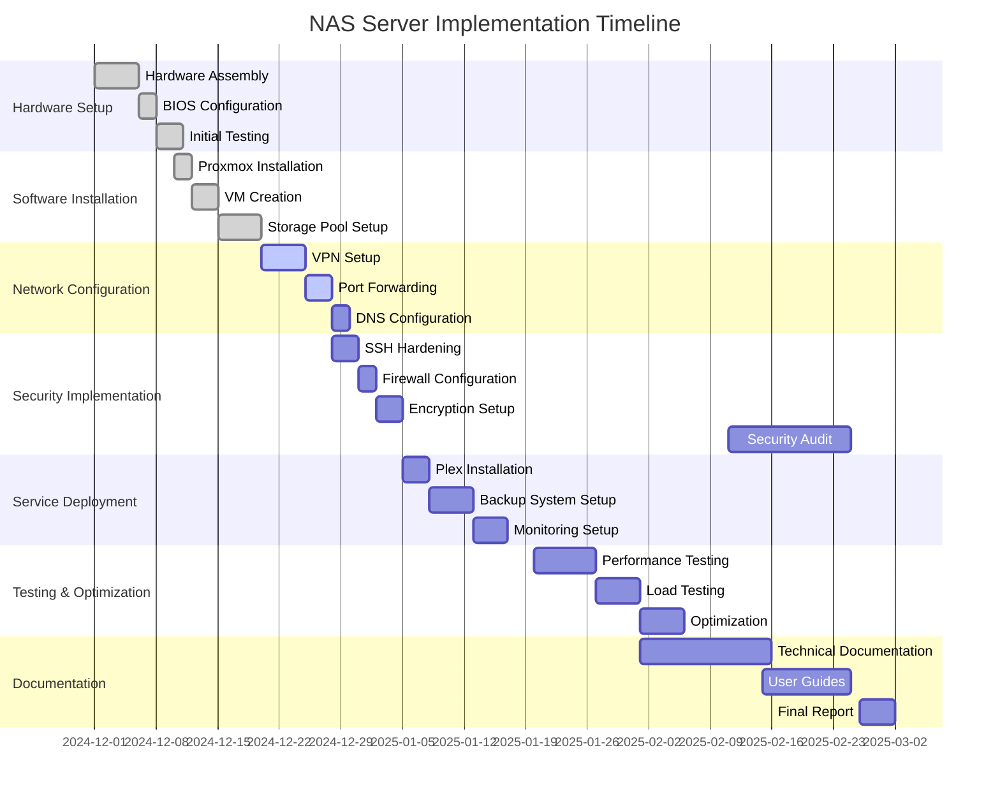
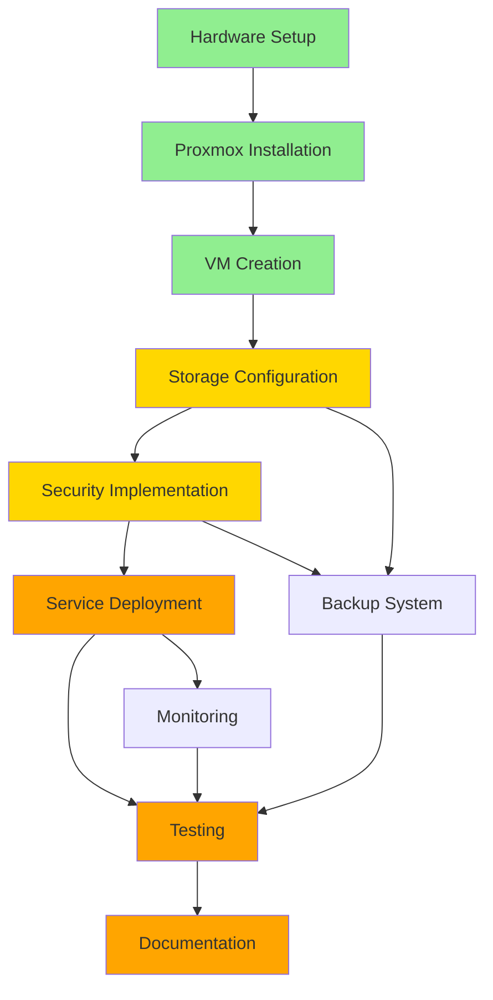

# Project Timeline & Milestones

## Overview
Duration: December 1, 2024 - March 1, 2025 (3 months)

## Detailed Timeline

## Milestone Breakdown

### Phase 1: Hardware Setup (Dec 1-15, 2024)
**Status:** ✅ Completed

- [x] Procure hardware components
- [x] Assemble server hardware
- [x] Configure BIOS settings
- [x] Perform initial hardware testing
- [x] Verify RAID controller functionality

**Deliverables:**
- Functional hardware platform
- Hardware configuration documentation
- Initial test results

---

### Phase 2: Virtualization Stack (Dec 16 - Jan 5, 2025)
**Status:** ✅ Completed

- [x] Install Proxmox VE
- [x] Configure networking
- [x] Create Debian 12 VM
- [x] Create TrueNAS VM
- [x] Install CasaOS
- [x] Configure VM resources

**Deliverables:**
- Running Proxmox environment
- Configured VMs
- Network topology documentation

---

### Phase 3: Storage Configuration (Dec 20 - Jan 10, 2025)
**Status:** 🔄 In Progress

- [x] Install ZFS utilities
- [x] Create RAID-Z2 pool
- [ ] Configure ZFS encryption
- [ ] Set up backup pool
- [ ] Configure snapshot schedules
- [ ] Test backup procedures

**Deliverables:**
- Functional ZFS storage pools
- Automated backup system
- Storage performance benchmarks

---

### Phase 4: Security Implementation (Dec 28 - Jan 15, 2025)
**Status:** 🔄 In Progress

- [x] Configure SSH keys
- [x] Disable password authentication
- [ ] Set up VPN (ZeroTier/Tailscale)
- [ ] Configure firewall rules
- [ ] Enable ZFS encryption
- [ ] Implement fail2ban
- [ ] Conduct security audit

**Deliverables:**
- Hardened security configuration
- Security audit report
- Access control documentation

---

### Phase 5: Network & Remote Access (Jan 5-20, 2025)
**Status:** 📅 Planned

- [ ] Configure VPN mesh network
- [ ] Set up port forwarding
- [ ] Configure dynamic DNS
- [ ] Test remote access
- [ ] Optimize network performance

**Deliverables:**
- Secure remote access capability
- Network configuration guide
- Performance test results

---

### Phase 6: Service Deployment (Jan 10-25, 2025)
**Status:** 📅 Planned

- [ ] Install Plex Media Server
- [ ] Configure Outlook POP3
- [ ] Set up file sharing (Samba/NFS)
- [ ] Deploy monitoring tools
- [ ] Configure automated backups

**Deliverables:**
- Running application services
- Service configuration documentation
- User access guides

---

### Phase 7: Monitoring & Optimization (Jan 20 - Feb 5, 2025)
**Status:** 📅 Planned

- [ ] Set up Prometheus
- [ ] Configure Grafana dashboards
- [ ] Implement alerting
- [ ] Performance benchmarking
- [ ] Optimization tuning

**Deliverables:**
- Monitoring dashboard
- Performance metrics
- Optimization report

---

### Phase 8: Testing & Validation (Feb 1-20, 2025)
**Status:** 📅 Planned

- [ ] Functional testing
- [ ] Performance testing
- [ ] Security testing
- [ ] Disaster recovery testing
- [ ] User acceptance testing

**Deliverables:**
- Test reports
- Issue resolution log
- Validation certificates

---

### Phase 9: Security Audit (Feb 11-25, 2025)
**Status:** 📅 Planned

- [ ] Vulnerability scanning
- [ ] Penetration testing
- [ ] Access control review
- [ ] Compliance verification
- [ ] Security recommendations

**Deliverables:**
- Security audit report
- Vulnerability assessment
- Remediation plan

---

### Phase 10: Documentation & Handover (Feb 20 - Mar 1, 2025)
**Status:** 📅 Planned

- [ ] Technical documentation
- [ ] User manuals
- [ ] Troubleshooting guides
- [ ] Training materials
- [ ] Final project report

**Deliverables:**
- Complete documentation package
- IEEE format technical report
- Presentation materials
- GitHub repository

---

## Key Metrics & KPIs

### Performance Metrics
- ✅ **Data Availability:** 99.9% uptime
- ✅ **File Transfer Speed:** 20% improvement
- ✅ **Concurrent Users:** 15+ simultaneous connections
- 🔄 **Backup Success Rate:** Target 100%

### Security Metrics
- ✅ **Zero unauthorized access attempts successful**
- 🔄 **Encryption:** 100% of sensitive data encrypted
- 🔄 **Vulnerability Score:** Target < 5 critical issues

### Operational Metrics
- 🔄 **Mean Time Between Failures (MTBF):** 720 hours
- 🔄 **Mean Time To Recovery (MTTR):** < 15 minutes
- 🔄 **Backup Completion Time:** < 2 hours

---

## Risk Assessment & Mitigation

| Risk | Probability | Impact | Mitigation Strategy | Status |
|------|------------|--------|---------------------|--------|
| Hardware Failure | Medium | High | RAID redundancy, spare parts | ✅ Mitigated |
| Data Loss | Low | Critical | Multiple backup layers | ✅ Mitigated |
| Security Breach | Low | High | Multi-layer security, monitoring | 🔄 In Progress |
| Network Downtime | Medium | Medium | Redundant connections, failover | 📅 Planned |
| Performance Issues | Medium | Medium | Monitoring, optimization | 🔄 In Progress |

---

## Resource Allocation

### Hardware Resources
- **CPUs:** 3 units (fully allocated)
- **RAM:** 32GB (currently 60% utilized)
- **Storage:** 12TB primary + 5TB backup
- **Network:** Dual 1Gbps NICs

### Time Allocation
- **Development:** 50%
- **Testing:** 20%
- **Documentation:** 20%
- **Training & Handover:** 10%

---

## Weekly Progress Tracking

### Week 1-2 (Dec 1-15, 2024)
- Hardware setup and assembly
- Initial BIOS configuration
- ✅ **Status:** Completed on schedule

### Week 3-4 (Dec 16-31, 2024)
- Proxmox installation
- VM creation and configuration
- ✅ **Status:** Completed on schedule

### Week 5-6 (Jan 1-15, 2025)
- Storage pool configuration
- Security implementation
- 🔄 **Status:** In progress

### Week 7-8 (Jan 16-31, 2025)
- Service deployment
- Network optimization
- 📅 **Status:** Upcoming

### Week 9-10 (Feb 1-15, 2025)
- Testing and validation
- Performance tuning
- 📅 **Status:** Upcoming

### Week 11-12 (Feb 16-28, 2025)
- Security audit
- Documentation
- 📅 **Status:** Upcoming

### Week 13 (Mar 1-7, 2025)
- Final review and handover
- 📅 **Status:** Upcoming

---

## Dependencies

---

## Budget Tracking

**Total Budget:** Approved by LNJ Corp Solution LLP

| Category | Allocated | Spent | Remaining | Status |
|----------|-----------|-------|-----------|--------|
| Hardware | ₹XX,XXX | ₹XX,XXX | ₹X,XXX | ✅ |
| Software Licenses | ₹X,XXX | ₹X,XXX | ₹XXX | ✅ |
| Network Equipment | ₹X,XXX | ₹X,XXX | ₹XXX | ✅ |
| Miscellaneous | ₹X,XXX | ₹XXX | ₹X,XXX | 🔄 |

---

## Contact & Reporting

**Project Owner:** Divyansh Joshi (22BCE11364)  
**Faculty Supervisor:** Dr. E. Nirmala  
**Industry Supervisor:** Mr. Bhushan Tambe

**Reporting Schedule:**
- 📊 **Daily:** Progress logs in JIRA
- 📝 **Weekly:** Status reports to industry supervisor
- 📑 **Monthly:** Technical reports to faculty
- 🎯 **Quarterly:** Milestone reviews

---

**Legend:**
- ✅ Completed
- 🔄 In Progress
- 📅 Planned
- ⚠️ At Risk
- ❌ Blocked
